# Telecom Support Ticket Resolution Assistant

A submission for **SynaptAI Use Case 2**: paste a customer complaint and receive its category, product, severity and sentiment, followed by a grounded troubleshooting plan with citations to KB procedures and relevant resolved cases.

The scope comes from the supplied hiring-challenge documents. See [requirements and verification](docs/requirements.md).

See [the latest verified Docker and test results](docs/verification.md) for the measured submission status.

The agent triage console displays the decision, priority and target, quoted field evidence, prior actions including durations and counts, a numbered cited plan, validation and provider badges, collapsible sources and up to three simulated resolved cases. Quick answers send structured observations attached to the selected issue. An answered wired check is removed from subsequent guidance.

The active `telecom_v3_1` corpus contains **62 AI-authored synthetic KB procedures, 240 simulated resolved training tickets, and 30 historical responses**. Procedures contain ordered customer checks, provider checks, conditional remedies, restrictions and completion criteria. Earlier corpora and frozen evaluation reports remain unchanged. Diagnostic gates remain unconfirmed and agent review is required.

The maintained suite has 50 Python tests (including PostgreSQL integration) and five UI tests. The latest 53-case local challenge report passes citation-validation and agent-review contract checks across all cases; this does **not** measure semantic correctness. See [verification](docs/verification.md) for evidence and remaining limitations. Human review of generated wording remains necessary.

Reproduce maintained comparisons and stage traces with unique output names:

```powershell
docker compose exec -e LLM_ENABLED=false api python -m scripts evaluate --split dev --output data/evaluation/postgres_dev_repeat.json
docker compose exec -e LLM_ENABLED=false api python -m scripts audit --split dev --output data/evaluation/stages_dev_repeat.json
docker compose exec -e LLM_ENABLED=false api python -m scripts audit --split test --output data/evaluation/stages_test_repeat.json
docker compose exec api python -m scripts audit --live --split dev --limit 30 --delay-seconds 60 --minimum-generated 20 --output data/evaluation/live_dev_repeat.json
```

The audit records generated and fallback answers separately and exits unsuccessfully when its generated-answer target is unmet. Earlier reports remain historical evidence. PostgreSQL scores under the compatibility `bm25` label are full-text ranks, not BM25.

## How it works

```mermaid
flowchart LR
    UI[Agent console and observations] --> API[FastAPI admission limits]
    API --> U[Local classifier and quoted context rules]
    U --> C[24-hour exact evidence cache]
    C -->|miss| H[Browser-owned reviewed recent cases]
    H -->|no applicable match| R[MiniLM + PostgreSQL FTS + RRF]
    DB[(PostgreSQL + pgvector)] --> H
    DB --> R
    C --> V[Applicability + exact-source validation]
    H --> V
    R --> V
    V --> L[Cited local conditional plan]
    L --> G[Groq wording]
    G --> M[Gemini critique + deterministic checks]
    M --> OUT[Agent review, sources and provider badge]
    L -->|quota or validation failure| OUT
    NEW[Stage new immutable KB version / evaluate new classes] --> DB
```



There is one application microservice and a separate database container. Understanding, retrieval and drafting stay as modules inside the API, keeping the deployment simple.

1. **Understand:** MiniLM classifier plus quoted context rules extract category, product, severity, sentiment, attempted actions and observations. Uncertain categories remain provisional. Out-of-scope input is rejected. Optional LLM extraction is disabled by default to preserve quota.
2. **Reuse safely:** check a bounded one-day JSON cache of public KB evidence. On a miss, search this browser's reviewed recent outcomes; load their current KB references and recheck applicability. Unresolved conversations never become repair evidence. Otherwise run semantic/lexical search and optional reranking.
3. **Draft:** build the ordered local plan, skip completed checks, preserve conditional remedies, cite KB and linked simulated tickets. Groq drafts wording; Gemini critiques it. Exact citations, original ordering and protected repair steps must pass. Any failure returns the local plan with an honest badge.
4. **Cache wording:** masked successful generated responses and supported critiques expire after 24 hours. Keys include the supplied evidence/observations and model configuration. JSON writes are atomic and each cache is bounded to 256 entries. Changes to the corpus revision invalidate evidence lookup. Similar complaints only reuse source selection with matching facts, not an old diagnosis.
5. **Evolve:** `python -m scripts stage incoming.jsonl --output data/updates/new_version/processed` validates additive updates without editing the active corpus. Chunk and index the new corpus with `CORPUS_DIR` pointing to its parent. `python -m scripts evolve --output data/evaluation/evolution_new_run.json` demonstrates a new category, training, calibration, indexing and regression checks in an isolated database. Activate a new category only with its matching classifier, routing and category mapping artifacts.

The output is assistance for a support agent. A cited historical outcome is not proof of the current fault; provider account actions and repairs remain for authorized support.

## Run with Docker

Prerequisite: Docker Engine or Docker Desktop with Compose.

```powershell
if (-not (Test-Path .env)) { Copy-Item .env.example .env }
# Existing .env files: set CORPUS_DIR=data/synthetic/telecom_v3_1.
# Set LLM_ENABLED=false for the fully local demo.
# For split roles, put both API keys in .env and set LLM_ENABLED=true.
docker compose --profile app up --build
```

Open [the agent console](http://127.0.0.1:8000), [API documentation](http://127.0.0.1:8000/docs), or [readiness](http://127.0.0.1:8000/api/v1/ready).

The API image runs as a non-root user. On first startup it initializes the schema, indexes the supplied corpus, trains missing local fallback artifacts, calibrates their routing and caches the reranker. Initial model downloads take longer than subsequent starts. PostgreSQL data, prepared artifacts and the model cache use persistent volumes. No live LLM call is needed for initialization.

When moving an existing index from local Python into Docker, library versions can change its configuration fingerprint. Container startup automatically re-embeds affected documents under the indexing lock, preserves source records and resumes completed batches after interruption. It still refuses an input corpus that omits previously indexed records. For a deliberate local runtime upgrade, use `python -m scripts index --rebuild`. Keep one runtime responsible for indexing a shared database.

Images: `support-resolution-assistant:local` is built from the Dockerfile; `pgvector/pgvector:pg16` supplies PostgreSQL. CI builds the API image and uploads a compressed Docker-image artifact after a successful build. That artifact can be loaded with `docker load -i support-resolution-assistant.tar.gz`. No registry publication is required to run this submission.

## Run with local Python

```powershell
python -m venv .venv
.\.venv\Scripts\Activate.ps1
python -m pip install -r requirements.txt
if (-not (Test-Path .env)) { Copy-Item .env.example .env }
docker compose up -d db
python -m scripts setup
python -m scripts prepare
python -m scripts chunk
python -m scripts index
python -m scripts train
python -m scripts calibrate
python -m scripts reranker
python -m scripts check
.\run.ps1
```

An existing PostgreSQL server with the vector extension can replace the database container. Configure its host and credentials in `.env`. Local fallback calibration is part of setup, rather than an undocumented prerequisite.

Useful settings:

```dotenv
LLM_ENABLED=true
GROQ_API_KEY=...
GROQ_MODEL=openai/gpt-oss-120b
GEMINI_API_KEY=...
GEMINI_MODEL=gemini-2.5-flash
LEXICAL_BACKEND=postgres
MAX_RESOLUTION_REQUESTS=2
```

Either key may be omitted. `LLM_ENABLED=false` runs the local fallback. `LEXICAL_BACKEND=bm25` keeps the original in-memory BM25 baseline for comparisons; PostgreSQL lexical scoring is full-text ranking, not BM25, and shares a GIN index across API workers. The compatibility API field `bm25_score` contains the configured lexical backend's score, so compare ranks rather than raw backend scores.

## API

| Endpoint | Purpose |
|---|---|
| `GET /api/v1/health` | Process liveness |
| `GET /api/v1/ready` | Database schema and published retrieval-index readiness |
| `POST /api/v1/analyze` | Category, product, severity, sentiment, observations and prior attempts |
| `POST /api/v1/retrieve` | Semantic/lexical/hybrid evidence with filters and optional reranking |
| `POST /api/v1/resolve` | Cited troubleshooting plan for one complaint |
| `POST /api/v1/conversation` | Same flow with bounded customer follow-ups |
| `GET /api/v1/metrics` | Request latency/errors and actual provider/fallback telemetry |
| `GET /metrics` | Content-free Prometheus-format counters/histogram for an external collector |

```json
{"query":"My broadband drops every evening around 8. Ethernet also drops. I already restarted the router twice. I work from home and this is costing me."}
```

POST this to `/api/v1/resolve`. The response includes `analysis`, `customer_plan`, optional LLM `language_plan`, exact source quotes, relevant `historical_cases`, citation validation and provider/fallback status. The UI uses optional generated introductory wording; v3 steps remain deterministic and this is labelled explicitly. `/workspace` is an alias for the same simple complaint form.

## Data and evaluation

The challenge explicitly permits synthetic data. This corpus has 60 authored telecom diagnostic families across 15 categories, 480 simulated-resolved variants, 30 unresolved examples and 60 conditional KB procedures. The retrieval index uses 330 records; dev/test tickets are excluded. Scenario families are separated across training, development and test. Training-only paraphrases augment the local classifier.

Synthetic resolutions stay `simulated_resolved`; they are never labelled as real customer outcomes. These authored labels test internal behavior, not real-world telecom resolution accuracy. Existing frozen results and exploratory reports remain under `data/evaluation/`; historical figures do not establish the performance of later code. Reports explicitly record provider usage and local fallback so an extractive run cannot be described as an LLM result.

```powershell
python -m ruff check app scripts tests
python -m pytest -q
# Optional, against the initialized PostgreSQL database; fixtures roll back.
$env:RUN_DB_TESTS="1"
python -m pytest tests/integration -q

# Record the same plans and follow-ups used by the UI.
python -m scripts quality --cases data/evaluation/response_quality_cases.json --output data/evaluation/quality_runs/my_run.json
python -m scripts review data/evaluation/quality_runs/my_run.json --output data/evaluation/my_summary.json

# Frozen retrieval/classifier ablations; choose a new report path.
$env:LLM_ENABLED="false"
python -m scripts evaluate --split dev --output data/evaluation/my_pipeline_dev.json

# Varied input load measurement against a running local API.
python -m scripts load --queries data/synthetic/telecom_v2/dev.jsonl --requests 30 --concurrency 2 --output data/evaluation/my_load.json
```

Offline tests cover complaint parsing, follow-ups, citations, unsupported instructions, provider fallback, retrieval/filtering, indexing, split separation and data evolution. Parameterized cases are individual checks, not separate scripts. Obsolete check/evaluation CLIs and saved-case workflow tests were removed. The necessary end-to-end behavior checkpoints are in `tests/evaluation/`.

Human-rating export/import is available through `python -m scripts ratings`; scores remain blank until someone supplies them. Existing rating files do not prove reviewer independence. Load reports distinguish errors, distinct input count, provider use and successful-request p95; local measurements are not production capacity guarantees.

## Evolving data and classes

```powershell
python -m scripts stage new_records.jsonl --output data/synthetic/telecom_v2/processed
python -m scripts.chunk_documents --directory data/synthetic/telecom_v2/processed
$env:CORPUS_DIR="data/synthetic/telecom_v2"
python -m scripts index
```

Staging validates records and links, preserves existing IDs and rejects importing dev/test records. Indexing fingerprints documents and skips unchanged entries. A new KB is available after indexing without retraining. For a new class, add its supported products to `data/category_products.json`; the LLM then sees the new category. Also provide train/dev examples and retrain/calibrate the local classifier if the new class must work during provider outages. Restart the API after activating new settings or models.

The worked DNS-category demonstration uses its own database and artifact paths:

```powershell
python -m scripts evolve --output data/evaluation/my_evolution.json
```

The default synthetic scenario generator has a fixed catalog. New material is authored as validated JSONL. This supports controlled updates, rather than a public upload feature.

## Production considerations and limits

Timeouts, bounded request admission, provider circuits/cache, readiness, parameterized SQL, index-update locks, exact source checks, sanitized errors and credential masking are implemented. Shared PostgreSQL lexical retrieval avoids per-worker corpus copies. One API worker keeps CPU model memory and the concurrency bound predictable; scale through service replicas with explicit resource budgets.

Deployment-specific authentication, centralized request admission, a reviewed provider KB and real customer benchmarks belong to a real telecom deployment. The challenge implementation uses English complaint extraction and a fictional-provider corpus. Metrics are process counters; an external scraper can retain them across restarts. The Docker image has been built and both services verified healthy against the existing database; CI additionally checks a fresh container startup. A hosted deployment is not an explicit deliverable in the supplied statement.

## Repository

`app/understanding`, `app/retrieval`, `app/resolution` and `app/llm` implement the core flow. `app/ingestion` handles corpus integrity/evolution; `app/evaluation` handles measurements. `app/api`, `app/database`, `app/monitoring` and `app/web` provide the service. `python -m scripts --help` lists the maintained setup, demo and evaluation entry points. [Interview notes](docs/interview-notes.md) explain the main tradeoffs.
