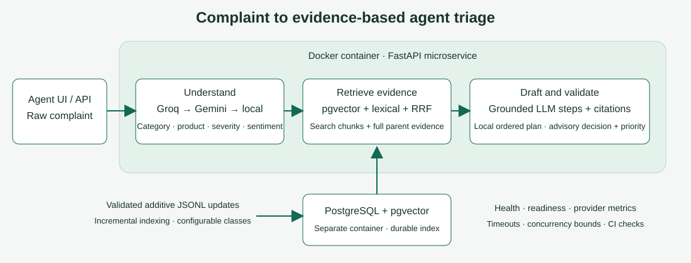

# Telecom Support Ticket Resolution Assistant

Use Case 2: a **support agent** pastes a telecom complaint and receives category, product, severity, sentiment, previous troubleshooting, relevant knowledge-base (KB) procedures, similar resolved tickets and a conditional cited plan. Keyword search misses paraphrases; semantic search complements exact matching.

The assistant proposes investigations for agent review. It does not diagnose a live network, execute repairs, refund payments or create handoffs. Supplied telecom evidence is **AI-authored synthetic, fictional and not telecom-expert reviewed**.

## Architecture



Editable source: [architecture.drawio](architecture.drawio). Solid arrows represent the main flow; dashed arrows indicate optional calls, reuse and fallback. Defaults refer to [.env.example](.env.example) and [docker-compose.yml](docker-compose.yml), not a private environment. Bare Python settings differ for persistent caching and split-provider review. FastAPI coordinates PostgreSQL/pgvector, MiniLM, full-text search, RRF, optional cross-encoder and vanilla JavaScript without LangChain.

## Pipeline, phase by phase

### 1. Validation, privacy and admission

**Input:** complaint and optional issue-linked replies. Pydantic rejects empty queries, unsupported options and oversized histories. Limits: 10, 000-character query; four explicitly separated issues; eight turns; 1, 000 characters per reply; 16, 000-character serialized history; 10, 000-character context per issue.

Explicit credentials are scrubbed before inference. Common email/phone/account identifiers and credentials are masked before remote calls; quotations are restored locally for offset checks. Stored conversations are redacted. Regex protections are not comprehensive PII detection.

An event-loop-local FIFO queue bounds expensive work before DB connections. Example settings permit two active requests, 32 queued and a 30-second wait. Overflow/timeout returns 503 with Retry-After. Client-IP-hash/global budgets return 429; Compose shares budgets through PostgreSQL. Budget-store failure returns 503. Forwarding headers are not automatically trusted.

**Output/failure:** normalized text or sanitized errors; infrastructure failure differs from insufficient evidence. Files: [models](app/understanding/models.py), [conversation](app/resolution/conversation.py), [privacy](app/llm/privacy.py), [admission](app/monitoring/admission.py), [budgets](app/monitoring/budgets.py), [middleware](app/monitoring/metrics.py).

### 2. Understanding, training and abstention

**Input:** complaint/replayed issue context. Multinomial logistic regression ranks categories using JSON coefficients. Training compares word/bigram TF-IDF and 384-dimensional MiniLM at C=1, 4, 16, weights examples by family and selects on development results. The inspected local artifact uses MiniLM at C=4; another training run can select differently. MiniLM is pretrained; this project trains the category head.

Calibration selects score/top-two-margin thresholds on dev subject to example/family accuracy floors; otherwise conservative defaults remain. Scores are uncalibrated, not probabilities of correctness or proven out-of-domain detection. Product compatibility constrains acceptance. API returns three candidates; UI can show provisional alternatives after abstention.

Rules extract products, actions (attempted/not_attempted/suggested), timing, wired/wireless scope, optical alarms, billing status, weather and other facts, with quoted text/offsets. Explicit observations can override uncertain routing: optical loss routes to outage investigation; wired service working can narrow Wi-Fi scope. These are reported symptoms, not confirmed causes.

Severity uses explicit impact, optional validated LLM assessment, quoted service-impact fallback, then accepted-category/fact estimation. Final rule **category_default** never invents quotes. Business impact can raise severity. Sentiment detects tone first; undetermined becomes **neutral**, rule **neutral_default**, with empty evidence. Default neutral is not detected emotion.

LLM extraction is disabled by default. Enabled extraction must pass schema/quote checks; failure returns rules. Off-topic requests receive unsupported_request without telecom troubleshooting. Uncertainty asks focused questions.

**Output:** analysis, candidates, quotes/actions/facts, questions and model/provider metadata. Files: [training](app/understanding/training.py), [classifier](app/understanding/classifier.py), [calibration](app/understanding/calibration.py), [signals](app/understanding/signals.py), [context](app/understanding/context.py), [service](app/understanding/service.py), [extraction](app/understanding/language.py).

### 3. Cache/reviewed history, then candidate search

**Input:** analysis/request/published revision. Resolution checks daily JSON **evidence cache**, browser-scoped reviewed outcomes, then eligible constrained semantic reuse before broad KB search. Hits still undergo applicability, reconstruction and validation.

The persistent solution cache stores public KB evidence, not complete private answers or diagnoses. Keys include request/analysis/index revision. Reviewed outcomes fetch current KB references and require current applicability; unresolved conversations are never successful-resolution evidence. Reuse is scoped to the same anonymous browser owner. Process caches default to 120 seconds; semantic reuse requires matching signatures/context and default 0.98 similarity. Masked wording/accepted-critique caches are separate.

**Candidate search** obtains possible evidence: normalized MiniLM vectors search chunks by cosine distance; lexical search finds exact terms. Revision/readiness guards hits/searches. Missing/incompatible/indexing evidence gives 503; DB timeout gives 504. Provider fallback cannot replace a missing DB/classifier.

Files: [lookup order](app/resolution/service.py), [cache](app/retrieval/cache.py), [reuse](app/resolution/reuse.py), [memory](app/resolution/memory.py), [disk cache](app/llm/disk_cache.py), [embeddings](app/retrieval/embeddings.py), [vectors](app/retrieval/vector_search.py).

### 4. Retrieval, ranking and applicability

**Retrieval** converts candidates into bounded ordered evidence. Compose uses PostgreSQL English tsvector/GIN, ts_rank_cd and safely bound OR-combined terms. In-memory BM 25 is an exploration alternative. API/report **bm25**, bm25_score/rank are compatibility labels: PostgreSQL configuration means full-text ranking, not true BM 25.

Hybrid RRF combines ranks by chunk identity as sum(1/(60+rank)), default 50 candidates/channel. Metadata filters are parameterized. Filtered vectors use exact eligible-row search; unfiltered can use cosine HNSW. Diversity reduces repeated chunks/families. Optional cross-encoder/ms-marco-MiniLM-L6-v 2 costs CPU. Resolve defaults to reranking; retrieve does not.

KB/resolved-ticket candidates are searched separately. Applicability rejects service/timing/symptom conflicts: optical loss defers unrelated remedies; daytime slowness does not imply evening congestion; storm wording without peak timing does not justify capacity selection. Local selection favors complete relevant procedures/avoids duplicate remedies. Optional LLM selection is disabled by default and restricted to supplied IDs. Default max_sources is two KB procedures. Logs show retrieved/eligible/selected/final IDs without raw complaint text.

**Output/failure:** selected KB/up to three histories or evidence gap; category similarity cannot authorize repair. Files: [RRF](app/retrieval/hybrid_search.py), [lexical](app/retrieval/lexical_search.py), [BM 25](app/retrieval/bm25_search.py), [diversity](app/retrieval/diversity.py), [reranking](app/retrieval/reranking.py), [applicability](app/resolution/applicability.py), [selection](app/resolution/selection.py), [history](app/resolution/history.py).

### 5. Deterministic cited steps

**Input:** complete procedures/exact spans. KB includes verification, customer/agent checks, diagnostic gate, conditional fix, restrictions, escalation and completion. Primary procedure supplies sequence; alternatives add conditional fixes/completion instead of repeated checklists.

Completed actions are acknowledged/skipped; skip_if_fact omits answered checks. Identical instructions are coalesced. Linked T citations support a step only if exact ticket resolution text matches. Category-only histories remain comparisons. Restrictions/escalation stay separate.

**Output:** customer_plan (legacy name for agent guidance), suggestions, sources/history. Typical procedures have five steps; answers/attempts change count. Evidence gaps are not padded into 5–10 invented instructions. Files: [parser](app/resolution/evidence.py), [drafting](app/resolution/drafting.py), [plan](app/resolution/customer.py), [rendering](app/resolution/rendering.py).

### 6. Optional wording, quotas and validation

Prompts supply observations/attempts/questions/exact procedures/linked histories/original steps/protected indices. They prohibit diagnoses, invented contacts, promises and repeated checks. Ordered rewrites preserve every step/order/citation; gates/fixes/completion/protected steps are copied. Restrictions stay outside generated wording.

**Default split mode:** LLM_SPLIT_REVIEW=true uses **Groq generation and Gemini critique**. Gemini is not generation failover here. Split mode false uses **Groq → Gemini** generation with same-provider critique. Missing keys, quotas, throttling, incomplete/schema-invalid output or rejected critique return labelled local plans. HTTP 429 honors retry guidance/increasing circuit cooldown (normally capped 300 seconds; longer provider delay honored). No long retry loop blocks a request. Shared budgets/duplicate-generation suppression bound calls.

Exact-source validation checks offsets, fields, citations, conditional rendering and narrow scope/grounding rules. Wording adds structural checks/model critique. Exact quotations/model approval do not prove arbitrary-text entailment or real diagnosis. Rejected wording falls back; failed validation can withhold guidance/escalate.

**Output:** local draft plus optional language_plan, provider/model, language status, critique, validation and limitations. method=local_extractive_v1 identifies underlying local draft even with generated wording. Files: [wording](app/resolution/language.py), [providers](app/llm/providers.py), [HTTP](app/llm/base.py), [validation](app/resolution/validation.py).

### 7. Policy, console, follow-ups and storage

Policy maps severity to normal/high/urgent and recommends clarify/agent_review/escalate with reasons/target(support_agent/network_operations/field_service). Hazards/shared outages, evidence gaps, failed validation and unsuccessful attempts affect routing. **agent_review_required=true; handoff_created=false.**

Console shows quoted field explanations, decision, numbered instructions, separate citations, KB/history, synthetic/provider/validation badges. **S1, S2…=KB; T1, T2…=historical tickets.** Labels are response-local; doc_id/ticket_id identify records. Right history drawer explicitly loads/deletes selections; opening starts a new complaint. Misleading simulated-review form is removed; review API remains.

Conversation replays original query/full turn history. Latest structured answers replace older observations but remain customer reports. Redacted PostgreSQL storage uses HttpOnly same-site owner cookie, hashed identity, seven-day default retention and revision conflicts 409. Browser isolation is **not production agent login**. Resolve creates no stored history; conversation can.

Files: [policy](app/resolution/policy.py), [conversation](app/resolution/conversation.py), [memory](app/resolution/memory.py), [API](app/api/resolution.py), [UI](app/web/app.js).

## Dataset and schemas

Active checked-in/configured baseline: [telecom_v3_1](data/synthetic/telecom_v3_1), version telecom-synthetic-3.1.0. Processed records/manifest contain **332 documents**:

| Type | Count | Meaning |
|---|---:|---|
| KB | 62 | Fictional procedures: 60 scenario articles, two baselines |
| Resolved tickets | 240 | Training complaints with simulated_resolved outcomes/KB refs |
| Historical responses | 30 | Unknown outcomes; not successful-resolution evidence |

The inspected local classifier has 15 classes: billing_dispute, broadband_outage, intermittent_broadband, iptv, mobile_coverage, mobile_data, number_porting, payment_restoration, roaming, router_ont_hardware, sim_esim_activation, slow_broadband, sms_otp, voice_call_failure, wifi_connectivity. Live intents can extend indexed documents; categories distinguishes model classes from counts.

Train: 240 queries/30 families; dev/test: 120 queries/15 families each. [Quality report](data/synthetic/telecom_v3_1/quality_report.json) records hashes. Query families are separated; dev/test tickets are excluded from index. Their reference KB remains searchable: unseen-complaint retrieval, not unseen knowledge creation. Train-only paraphrases add variants, not independent scenarios. Never tune on test.

Labels include intent/product/severity/sentiment, attempts, relevant_kb_ids, diagnostic gates, forbidden actions. Relevance is author-assigned/non-exhaustive; contrast candidates need review before negatives. Synthetic templates limit independence. The 53-case challenge is also AI-authored, partly already regression/development evidence.

### Corpus records

Raw KB: knowledge_base.jsonl; tickets/replies: tickets.jsonl. Merged documents/chunks/manifests live in processed/. PostgreSQL mirrors documents/vectors. Live ingestion updates **processed artifacts**, not raw/frozen files; preserve updates when regenerating/migrating.

Shortened actual-record extracts, **not complete ingest payloads**:

```json
{
  "doc_id": "syn_kb_BB01",
  "doc_type": "knowledge_base",
  "title": "Red LOS light or optical signal loss",
  "intent": "broadband_outage",
  "product": "fibre_broadband",
  "outcome_status": "unknown",
  "metadata": {
    "is_synthetic": true,
    "procedure_version": 3,
    "authority": "fictional_provider_policy",
    "procedure": {
      "diagnostic_gate": "an optical test finds no received signal, the account is active, and a technician confirms an external-line fault",
      "fix_if_confirmed": ["request an authorised technician to inspect and repair the confirmed external-line fault"],
      "restriction": ["Do not factory-reset the router or tell the customer to handle exposed fibre."]
    }
  }
}
```

Full article adds body, verify, customer_checks, agent_checks, escalate_if, completion and steps(id, phase, text, optional skip_if_fact). Search may use metadata.retrieval_body; validation uses current parent procedure text. Search summaries can differ from full instructions.

```json
{
  "doc_id": "syn_ticket_BB01_01",
  "doc_type": "resolved_ticket",
  "intent": "broadband_outage",
  "product": "fibre_broadband",
  "severity": "high",
  "sentiment": "neutral",
  "ticket_type": "incident",
  "outcome_status": "simulated_resolved",
  "metadata": {
    "ticket_id": "syn_ticket_BB01_01",
    "is_synthetic": true,
    "scenario_family": "BB01",
    "split": "train",
    "kb_refs": ["syn_kb_BB01"],
    "outcome_evidence": "Simulated follow-up: optical signal restored and wired browsing works."
  }
}
```

Full ticket also needs title, complaint body and resolution. Real verified_resolved needs outcome provenance and cannot be synthetic. Historical response needs response, unknown outcome, no resolution. [SupportDocument](app/ingestion/schema.py) validates records; schema validity alone does not guarantee useful procedures.

### PostgreSQL relationships/indexes

| Table | Key/relationship | Role |
|---|---|---|
| documents | doc_id PK | Text, outcome checks, labels, JSONB metadata |
| chunks | chunk_id; cascading doc_id FK; unique(doc_id, chunk_index) | Search text, English tsvector, vector(384) |
| document_index_state | doc_id FK | Content/config fingerprint, chunk count |
| retrieval_index_state | Singleton | Publication state, hashes, timestamp |
| support_conversations | UUID, owner/revision | Redacted replay, expiry |
| support_conversation_events | (conversation_id, revision), cascading FK | Responses/source revision |
| support_reviewed_resolutions | history_id, cascading conversation FK | Owner-scoped simulated outcomes, source links, vector(384) |
| support_request_budgets | bucket_key | Hashed shared tokens/cooldowns |

MiniLM vectors: normalized, 384 dimensions. Chunking: 256 tokens including special tokens, 32 content-token overlap. Resolutions remain parent evidence, not mixed into complaint search. Indexes: cosine HNSW, full-text GIN, document type/intent/product B-trees, owner/budget-expiry indexes. No dedicated reviewed-outcome HNSW declared. [Schema](db/init.sql),[migrations](db/migrations),[repository](app/database/index_repository.py).

### Complaint/follow-up and output

Resolve accepts query, max_sources(default 2, 1–5), rerank(default true), filters(doc_type, intent, severity, ticket_type, product, queue); only KB doc_type allowed. **turns belongs to conversation, not resolve**; extra fields rejected.

Conversation adds turns, optional conversation_id/revision. Turn: issue_id 1–4, message and/or observations. Observation enums: wired_connection working/failing/unavailable; wireless_devices one/all; impact complete_loss/intermittent/working; mobile_services calls/texts/data/several; billing_status pending/settled; tv_symptom no_picture/error/buffering. Other fields: charge, area, started, provider, region. Unknown/service-mismatched observations rejected.

| Output | Content |
|---|---|
| status | needs_diagnostic_confirmation/needs_clarification/insufficient_evidence/unsupported_request |
| analysis | Fields, candidates, quotes, rules, actions, facts |
| decision | Action, priority, target, reasons, handoff_created=false |
| customer_plan/draft | Local guidance/internal review draft |
| suggestions | Required findings, conditional remedies, restrictions, repeat withholding |
| sources/historical_cases | S/T labels, doc/chunk IDs, quotes, KB refs, provenance, relationships |
| validation | Status, count, issues, scope |
| language_*/faithfulness_* | Optional wording, provider/model, disabled/generated/fallback, critique |
| Other | Questions, acknowledged_actions, limitations, evidence_reuse, elapsed_ms |

Conversation wraps issues[{issue_id, complaint, analysis_text, resolution}], storage(client_replayed/postgres_redacted), conversation_id/revision. No current response is fabricated here.

## Run the application

### Docker: PowerShell at repository root

Requires Docker Desktop/Linux containers/Compose; initial model downloads need network. Main API 8000/database 5432 unless occupied.

```powershell
if (-not (Test-Path .env)) { Copy-Item .env.example .env }
# Set LLM_ENABLED=false in private .env for reproducible local plans.
docker compose --profile app config --quiet
docker compose --profile app up --build -d
docker compose exec -T api python -m scripts check
Invoke-RestMethod http://127.0.0.1:8000/api/v1/health
Invoke-RestMethod http://127.0.0.1:8000/api/v1/ready
```

Open [console](http://127.0.0.1:8000/) or [Swagger](http://127.0.0.1:8000/docs). API_PORT changes host port; container stays 8000. Persistent DB/data/model volumes retain state; do not delete volumes to upgrade.

Bootstrap applies schema, seeds missing corpus only, chunks if needed, indexes with --rebuild for config changes, trains/calibrates missing artifacts, warms embeddings/reranker, then starts one Uvicorn worker. First startup can take minutes. Rebuild after source/UI changes; Ctrl+F 5 refreshes browser assets.

### Local Python: PowerShell

Python 3.12 is CI/Docker reference; PostgreSQL needs pgvector. Use checked-in active artifacts rather than unnecessary regeneration.

```powershell
python -m venv .venv
.\.venv\Scripts\Activate.ps1
python -m pip install torch --index-url https://download.pytorch.org/whl/cpu
python -m pip install -r requirements.txt
if (-not (Test-Path .env)) { Copy-Item .env.example .env }
docker compose up -d db
python -m scripts setup
python -m scripts chunk
python -m scripts index
python -m scripts train
python -m scripts calibrate
python -m scripts reranker
python -m uvicorn app.main:app --host 127.0.0.1 --port 8000
```

Only if processed corpus is missing: prepare builds through retained generators. Regeneration after live ingest requires preserving updates. Do not serve Docker/local on same port or index same DB concurrently with incompatible embedding libraries. index --rebuild intentionally writes artifacts.

| Setting | Example/Compose behavior |
|---|---|
| CORPUS_DIR | data/synthetic/telecom_v3_1 |
| LEXICAL_BACKEND | postgres; bm25 alternative exploration |
| LLM_ENABLED | Example true; false local plan |
| GROQ_API_KEY/GEMINI_API_KEY | Empty placeholders; private environment/.env only |
| LLM_SPLIT_REVIEW | True: Groq generation/Gemini critique; false: failover chain |
| LLM_EXTRACTION_ENABLED/LLM_SELECTION_ENABLED | False; extra calls when enabled |
| SOLUTION_CACHE_ENABLED/SECONDS | Compose true; TTL up to 86400 seconds |
| CONVERSATION_STORAGE_ENABLED/CONVERSATION_RETENTION_DAYS | True/seven days |
| INGEST_ADMIN_KEY | Empty disables; private key enables |
| Pool/admission/provider budgets | Resource bounds, not throughput SLA |

Changed environment needs docker compose --profile app up -d --force-recreate api. Genuine LLM evidence requires language_status=generated_for_review and actual provider/model; enabling a flag is insufficient. Missing a split-mode provider can cause fallback.

## Three demo requests and screenshot instructions

Swagger: expand **POST /api/v1/resolve → Try it out → Execute**. These are inputs/review expectations, not observed current outputs.

**Evening drops/work impact/two restarts:**

```json
{"query":"My broadband drops every evening around 8 and I've already restarted the router twice, I work from home and this is costing me.","max_sources":2,"rerank":true}
```

Inspect intermittent routing, high work-impact severity, tone evidence, preserved twice, no repeated restart, wired-vs-Wi-Fi question, conditional peak-hour investigation. Congestion remains unconfirmed.

**Red LOS:**

```json
{"query":"No internet at all. The optical box shows a red LOS light. I restarted the router three times and checked every cable; nothing changed.","max_sources":2,"rerank":true}
```

Inspect optical-loss/outage routing, relevant tests, safe authorized-repair conditions, no repeated restart. A red light must not become a proven external fibre break.

**Duplicate settled payment:**

```json
{"query":"I paid the same broadband invoice twice. Both payments are settled, not pending, and my bank statement shows two debits for that invoice. Internet is working. Please help correct the duplicate payment.","max_sources":2,"rerank":true}
```

Inspect settled-payment relevance, conditional reconciliation/correction, no refund deadline or claim a refund occurred.

PowerShell sends/saves all three to new files:

```powershell
$base = 'http://127.0.0.1:8000'
$outputDir = Join-Path '.work' ('reviewer-' + (Get-Date -Format 'yyyyMMdd-HHmmss'))
New-Item -ItemType Directory -Path $outputDir | Out-Null
$complaints = [ordered]@{
    evening = "My broadband drops every evening around 8 and I've already restarted the router twice, I work from home and this is costing me."
    los = 'No internet at all. The optical box shows a red LOS light. I restarted the router three times and checked every cable; nothing changed.'
    payment = 'I paid the same broadband invoice twice. Both payments are settled, not pending, and my bank statement shows two debits for that invoice. Internet is working. Please help correct the duplicate payment.'
}
foreach ($case in $complaints.GetEnumerator()) {
    $body = @{ query = $case.Value; max_sources = 2; rerank = $true } | ConvertTo-Json
    $result = Invoke-RestMethod -Method Post -Uri "$base/api/v1/resolve" -ContentType 'application/json' -Body $body -TimeoutSec 180
    $result | ConvertTo-Json -Depth 50 | Set-Content -Encoding utf8 (Join-Path $outputDir ($case.Key + '.json'))
}
```

Structured follow-up for **POST /api/v1/conversation**:

```json
{
  "query": "My broadband drops every evening around 8 and I've already restarted the router twice, I work from home and this is costing me.",
  "turns": [{
    "issue_id": 1,
    "message": "My laptop connected by Ethernet also loses internet during the evening drop.",
    "observations": {"wired_connection": "failing", "impact": "intermittent"}
  }]
}
```

For stored replay add returned conversation_id/revision, retain original query/all turns, and use PowerShell -SessionVariable/-WebSession to retain owner cookie. Answers remain reports, not provider confirmation.

### Screenshots to take

1. **Swagger resolve/evening:** request body/HTTP 200; response analysis (severity/sentiment evidence/actions), decision, customer_plan, sources, historical_cases, validation, language_status/provider. Long JSON may need two captures.
2. **Swagger resolve/LOS and payment:** plan, relevant source IDs/quotes, conditional gate, decision/validation.
3. **Swagger conversation:** structured request, issues[0].resolution.analysis.reported_facts, updated questions/plan, revision; check answered wired question is not repeated.
4. **Console:** wide workspace, field chips, decision, separate instructions/citations, S/T legend, provider/synthetic badges. Open why/source evidence. Capture history drawer separately.
5. **Operations/evolution:** ready scope, categories before/after, user-run ingest response. Hide keys/identifiers. Capture local and genuinely generated LLM separately.

> **Screenshot placeholder — evening:** add current local triage after case 1.
>
> **Screenshot placeholder — LOS/settled payment:** add relevant sources/conditional plans.
>
> **Screenshot placeholder — follow-up/history:** add structured-answer result and explicitly opened drawer.
>
> **Screenshot placeholder — generated LLM/evolution:** add only actual generated output/user-run ingest; label fallback honestly.

No screenshots are fabricated or claimed as fresh evidence.

## API inventory

Paths below have /api/v1 unless bold full path. Swagger /docs, ReDoc /redoc, schema /openapi.json. / and /workspace serve console;/assets/* serves files.

| Method/path | Purpose/input | Authentication/isolation |
|---|---|---|
| POST /analyze | {query} → analysis without retrieval | No agent login; admission budgets |
| POST /retrieve | Query/top_k/mode/filters/candidate_k/diversify/rerank/rerank_k → ranked evidence | No agent login; admission budgets |
| POST /resolve | ResolutionRequest → review draft | No agent login; admission budgets |
| POST /conversation | ConversationRequest → issue drafts/stored revision | Owner cookie for storage; admission |
| GET /conversations | Recent unexpired history | Owner cookie; origin checks where Origin present |
| GET /conversations/{id} | Request/revision; UI re-evaluates | Owner-scoped UUID lookup |
| DELETE /conversations/{id} | Delete cascading history/review | Owner-scoped UUID lookup |
| POST /conversations/{id}/review | issue_id/revision/outcome_note(20–1000 chars)/confirmation=simulated_resolution_reviewed | Owner/revision/validation rules; simulated only |
| POST /ingest | 1–20 SupportDocument records → report | X-Admin-Key; empty disables |
| GET /categories | Model classes/indexed intent counts | No additional authentication |
| GET /health | Liveness | No additional authentication |
| GET /ready | DB schema/vector extension/index state | No additional authentication |
| GET /metrics | **/api/v1/metrics** JSON summary | No additional authentication |
| GET **/metrics** | Prometheus text, outside API prefix | No additional authentication; not OpenAPI |

Health can return 200 with DB unavailable. Ready returns 503 for schema/index failures; scope **database_schema_and_index_state**, not full model inference. Container warms models separately. Production authentication/TLS/RBAC are deployment needs.

## Retained evaluation and metrics

### Historical release, local path only

These **2026-10-05 snapshots** cover 120 queries/15 families per split, local_fallback_only, PostgreSQL lexical, published MiniLM. Later severity/neutral-default/UI/ingestion changes are not automatically measured.

| Metric/scope | Dev — [exact report](data/evaluation/v31_postgres_dev_release_20261005.json) | Test — [exact report](data/evaluation/v31_postgres_test_release_20261005.json) |
|---|---:|---:|
| Published category top-1 accuracy | 76.67% | 83.33% |
| Macro-F 1 | 0.7551 | 0.8077 |
| PostgreSQL lexical (bm25 label) hit@5 | 77.50% | 88.33% |
| Dense hit@5 | 55.83% | 55.83% |
| Mixed hybrid hit@5 | 72.50% | 84.17% |
| Diverse hybrid hit@5 | 89.17% | 94.17% |
| KB-focused hybrid hit@5 | 90.00% | 95.83% |
| KB-focused reranked hit@5 | 93.33% | 100.00% |
| Final draft contains expected KB | 82.50% | 80.00% |
| Citation contract passed | 100.00% | 100.00% |
| Drafts with sources | 116/120 | 100/120 |
| Severity correct/unknown | 40.00% / 43.33% | 13.33% / 83.33% |
| Sentiment correct/unknown | 75.00% / 25.00% | 100.00% / 0.00% |
| Sequential comparison p50/p95 ms | 4666 / 6282 | 6996 / 16658 |

Columns come from linked classifier_comparisons/summary. Final retention is across all queries, not conditional on retrieval hit. KB-only is narrower than mixed retrieval. Latency includes sequential strategy comparisons, not API SLA. Citation validity is neither diagnosis nor relevance. Synthetic sentiment does not establish language robustness.

### Challenge/human review

[v31_challenge_confirmed_20261005.json](data/evaluation/v31_challenge_confirmed_20261005.json): run_complete=true, 53 authored cases, 66 snapshots, 72 issue resolutions, all inspected language_status=disabled. Manual context/relevance/conversation/grounding/clarity ratings are empty. Completed replay is **not human plan-quality scoring or successful LLM evaluation**. Review each expectation, including irrelevant queries, optical loss, billing, sarcasm, language variation, follow-up corrections.

### Historical load smoke test

All values:[load_test_report.json](data/evaluation/load_test_report.json). Offline/extractive local API, one repeated synthetic query, warm caches, 20 requests per concurrency, no retries, budgets retained across runs; cold pre-run excluded.

| Concurrency | All-status p50/p95/p99 ms | Accepted | All RPS / successful RPS | 429/503 | Error/rejection | Successful p95 ms |
|---|---:|---:|---:|---:|---:|---:|
| 1 | 145/182/189 | 12/20 | 7.68 / **4.61** | 8/0 | 40% | 189 |
| 5 | 133/292/381 | 3/20 | 29.53 / **4.43** | 11/6 | 85% | 381 |
| 20 | 480/527/532 | 2/20 | 30.40 / **3.04** | 11/7 | 90% | 506 |

First cold sample 19676 ms. Historical budgets: two active requests, client 60/minute with burst 10, global 120/minute with burst 20. Current examples differ. Fast rejections inflate RPS: **not production capacity**, varied sustained traffic or independent concurrency runs. No provider calls recorded.

### Monitoring and CI

Prometheus exposes request/error/admission/pool/provider signals, resolve_provider_total{provider, outcome}, resolve_fallback_total, citation_validation_total{status}, solution_cache_total{outcome=hit|miss}, stage_duration_seconds{stage}, ingest_total{outcome=success|failure} and ingest_documents_added_total counters. Stages: understand/retrieve/draft/validate. Counts are invocations, not unique requests; stages may run twice. Solution cache covers enabled persistent evidence lookups; fallback counts failed attempted wording, not LLM-off. Metrics reset on restart; external scraping needed. Exact labels:[metrics.py](app/monitoring/metrics.py).

[Gate](scripts/eval_gate.py) runs frozen dev, LLMs/persistent solution caching disabled, PostgreSQL lexical, checks dev checksum, and enforces [thresholds](data/evaluation/gate_thresholds.json): category 0.7466667, KB-focused hit@5 0.88, citation 0.98 (baseline minus 2 points). It does not gate severity, semantic quality or capacity. [CI](.github/workflows/ci.yml): Ruff, UI tests, DB-enabled pytest, index/train/calibrate, dev gate; separate Docker build/bootstrap job. Tests alone do not satisfy the entire rubric.

## Evolution and limits

POST ingest requires X-Admin-Key matching private INGEST_ADMIN_KEY; empty/wrong returns 403. SupportDocument/staging reject duplicate IDs, dev/test imports, unresolved KB refs; add or replace by ID, retain existing records. Reference checking verifies ID existence, not full knowledge curation.

Writer advisory lock(8041, 2) coordinates readers/publishers. Merged documents/chunks/manifests are staged separately; indexing uses one outer transaction, skips unchanged fingerprints, embeds changed chunks. Files replace atomically **per file** before commit under lock. Ordinary exceptions restore backups/roll back DB. Source/chunk/config hashes plus timestamp change revision, invalidate revision-keyed caches. This does not guarantee filesystem/DB crash atomicity after abrupt host/process loss. Raw files/classifier weights stay unchanged.

Response: added, updated, embeddings_generated, new_categories, classifier_retrain_required, category_prediction_note, revision, elapsed_ms. New KB is searchable via retrieve immediately; resolve retention also needs valid scope/procedure/applicability. New labels need examples, category-product mapping, train/dev calibration and API restart to load cached classifier; ingest does not learn classes automatically.

### DNS demos: explicitly mutating, user-run commands

[Fixture](data/evolution/dns_category_demo.json) contains article/query/new-class examples.

```powershell
# Changes current processed corpus/index;needs private admin key.
python -m scripts ingest-demo --url http://127.0.0.1:8000
# Container alternative uses configured private environment:
docker compose exec -T api python -m scripts ingest-demo
# Isolated experiment:separate corpus/database,new-class train/calibrate.
python -m scripts evolve --output .work/dns-evolution-new.json
```

Live demo prints before/after sources and ingest response; no retraining. Repeats replace same ID. [Isolated evolution](scripts/demonstrate_evolution.py) checks active fingerprints, new-class training/calibration, indexing, old-class dev regression. It requires DB creation permissions/model availability. **Not run for this documentation update.**

### Remaining limits/evidence gaps

- Evidence is synthetic, fictional and not telecom-expert reviewed; real authorized, de-identified outcomes/procedures need curation.
- Rules/classifier can misread language, sarcasm/ambiguity. Neutral/category-severity defaults are estimates. Historical severity is weak; fresh fallback measurements needed.
- Exact citations/protected wording do not prove useful diagnosis. Human ratings are missing; retained final-source retention is lower than retrieval hit rates.
- Retained reports do not verify current genuine LLM generation; keys/quotas/critique can force fallback.
- CPU embeddings/reranking, exact filtered scans, model memory, worker queues, shared-budget contention/filesystem caches need measured scaling. Replicas need consistent artifacts/publication/cache coordination; no autoscaler/distributed-filesystem/SLA proof.
- Anonymous owner/admin secret are not production authentication. Redaction is heuristic. No network/billing execution. Crash recovery needs testing beyond ordinary exceptions.

Core complaint-to-cited-plan and evolving retrieval are implemented. **Complete production suitability and every rubric requirement cannot be inferred from test counts.**

## Reproduce verification and record fresh scores

Use new filenames, preserve retained snapshots. Supplied for reviewer execution, not claimed as freshly run here:

```powershell
python -m ruff check app scripts tests
python -m ruff format --check app scripts tests
python -m pytest tests/unit -q
node --test tests/web/agent_console.test.cjs
$env:RUN_DB_TESTS = '1'
python -m pytest -q
python -m scripts.eval_gate
docker compose --profile app config --quiet
```

Gate needs indexed/trained artifacts; integration tests need an isolated writable database. Existing runner clears response caches, restarts API, and writes timestamped .work/evaluation-* dev/test/53-case replay reports without retraining/tuning on test:

```powershell
.\scripts\run_evaluation.ps1
# Additional three-case provider replay:inspect status for quota fallback.
.\scripts\run_evaluation.ps1 -IncludeLlm
```

Models/corpus/index remain; response caches cleared. Comparisons run in separate Compose process against shared index. Local alternatives with prepared artifacts:

```powershell
python -m scripts evaluate --split dev --output .work/dev-new.json
# Final held-out evaluation:do not tune from its results.
python -m scripts evaluate --split test --output .work/test-new.json
python -m scripts quality --output .work/quality-new.json
```

Pipeline evaluation records local_fallback_only. For smoke load, start offline API deliberately; load script does not disable server LLMs:

```powershell
foreach ($concurrency in @(1,5,20)) {
    python -m scripts load --url http://127.0.0.1:8000 --requests 20 --concurrency $concurrency --output ".work/load-new-$concurrency.json"
}
```

Budgets remain across runs. Capacity studies require controlled spacing/reset, varied JSONL --queries, sustained duration, accepted/rejected latencies. python -m scripts --help lists setup/prepare/chunk/index/check/train/calibrate/reranker/analyze/resolve/converse/evaluate/audit/quality/load/demo/stage/evolve/ingest-demo/clear-caches plus retained publication helpers.

## Repository map and reading order

| Location | Responsibility |
|---|---|
| app/api, app/config, app/main.py | Contracts/settings/composition |
| app/understanding | Features/train/calibrate/signals/quotes/extraction |
| app/retrieval | Dense/lexical search/RRF/diversity/reranking |
| app/resolution | Cache/history/applicability/selection/plan/validation/policy |
| app/llm | HTTP/privacy/provider circuits/budgets/caches |
| app/ingestion, db | Validation/indexing/publication/schema |
| app/monitoring, app/web | Admission/metrics/console |
| app/evaluation, scripts, tests | Comparisons/gate/replay/demo/regression |
| data/synthetic/telecom_v3_1, data/evaluation | Active artifacts/splits/retained evidence |

Reading order: API models → resolution/service.py → understanding/service.py → hybrid/applicability → customer/validation → language/providers → retained reports → ingestion/live.py. [Design decisions](docs/design-decisions.md) summarize operational choices;[ideas](docs/ideas.md) distinguish hypotheses/experiments/future work. Legacy generators remain because preparation/tests reference them.

### Documentation verification scope

Implementation/report/schema/command definitions and local links were checked. Read-only HTTP on 2026-10-06 returned health HTTP 200, ready and OpenAPI endpoint inventory from port 8000. No fresh resolve outputs, screenshots, full eval/load, ingestion, retraining or deployment are claimed. Docker/local setup and mutating demo commands were inspected against code, not re-executed. Genuine LLM generation, human plan quality, production capacity remain evidence gaps.
