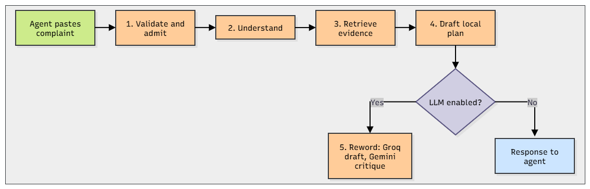
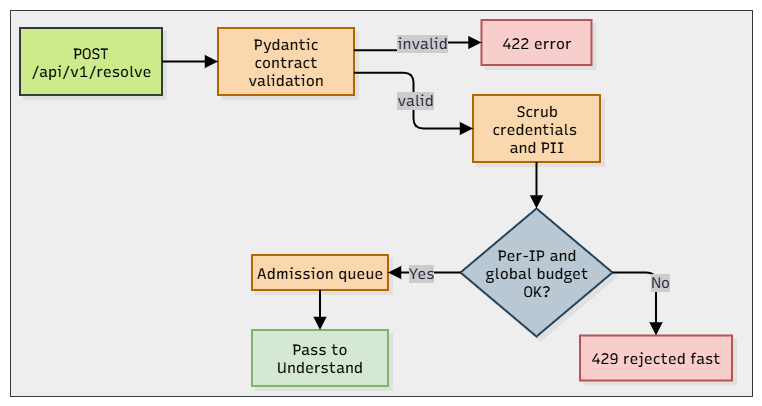
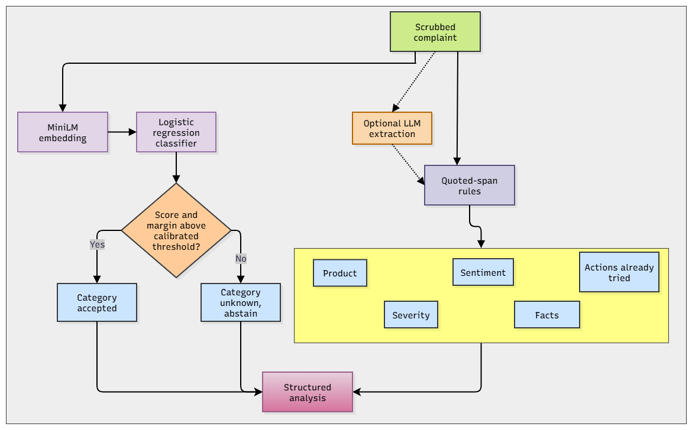
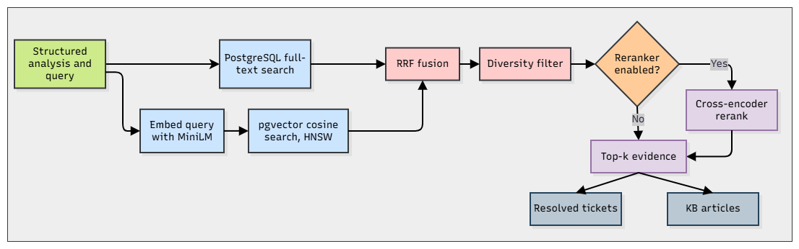
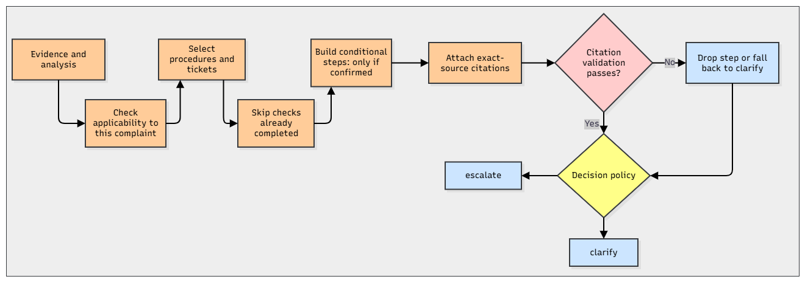
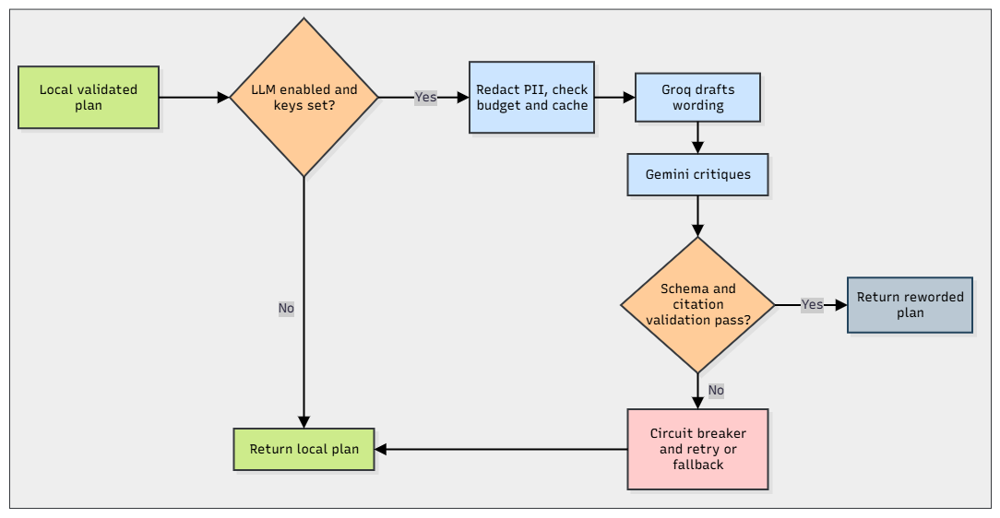
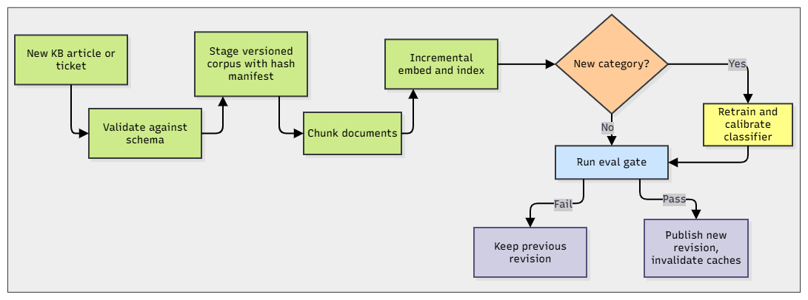

# Telecom Support Ticket Resolution Assistant

> **Use Case 2.** An agent pastes a customer complaint and gets back the **category, product, severity, sentiment, steps already tried, relevant KB procedures, similar resolved tickets**, and a **cited, conditional troubleshooting plan**.

**Scope:** the assistant *proposes* checks for **agent review**. It does **not** diagnose live networks, run repairs, issue refunds or create handoffs.
**Data:** all telecom evidence is **AI-authored synthetic** and **not expert-reviewed**.

## Demo

[Watch Demo here](./docs/demo/demoVideo.mp4)

## Architecture



| # | Phase | What happens |
|---|-------|--------------|
| 1 | **Validate & admit** | Pydantic contracts, **credential scrubbing**, per-IP and global **admission budgets** |
| 2 | **Understand** | MiniLM **classifier** plus quoted-span rules give category, product, severity, sentiment, actions tried and facts |
| 3 | **Retrieve** | **Hybrid search** (pgvector + PostgreSQL FTS, fused with **RRF**) plus optional **reranker** over KB articles and resolved tickets |
| 4 | **Draft** | Local **conditional plan** with exact-source **citations**; skips completed checks and keeps restrictions |
| 5 | **Reword (optional)** | **Groq** drafts, **Gemini** critiques; any failure falls back to the local plan |

---
### Phase 1: Validate & Admit


### Phase 2: Understand


### Phase 3: Retrieve


### Phase 4: Draft Plan


### Phase 5: Reword


### KB Evolution


## Quick Start

### Docker (recommended)

```powershell
if (-not (Test-Path .env)) { Copy-Item .env.example .env }
# Optional: set GROQ_API_KEY / GEMINI_API_KEY, or LLM_ENABLED=false for local-only plans
docker compose --profile app up --build -d
docker compose exec -T api python -m scripts check
```

Then open the [agent console](http://127.0.0.1:8000/) or [Swagger UI](http://127.0.0.1:8000/docs). First startup downloads models and prepares missing artifacts; it can take several minutes. Do not delete persistent volumes to upgrade.

### Local Python

```powershell
python -m venv .venv
.\.venv\Scripts\Activate.ps1
python -m pip install torch --index-url https://download.pytorch.org/whl/cpu
python -m pip install -r requirements.txt
if (-not (Test-Path .env)) { Copy-Item .env.example .env }
docker compose up -d db
python -m scripts.setup_database
python -m scripts chunk
python -m scripts index
python -m scripts train
python -m scripts calibrate
python -m scripts reranker
python -m uvicorn app.main:app --host 127.0.0.1 --port 8000
```

> `data/models` is git-ignored, so **train and calibrate are required** after a fresh clone.


## Commands

Run as `python -m scripts <command>`.

| Command | Purpose |
|---------|---------|
| `prepare` | Build the **synthetic corpus** |
| `chunk` | Split documents into overlapping chunks |
| `index` | Embed chunks and upsert into **pgvector** |
| `check` | Verify **index readiness** and embedding norms |
| `train` | Fit the **category classifier** on train; select the model using dev |
| `calibrate` | Choose **score/margin thresholds** on dev |
| `reranker` | Warm the **cross-encoder** |
| `analyze` | Run understanding on one complaint |
| `resolve` | Run the **full pipeline** on one complaint |
| `evaluate` | **Frozen** dev/test evaluation |
| `load` | **Load test** against a running API |
| `demo` | Quick offline demo with verification |
| `evolve` | Isolated **new-class demo** in a fresh DB |

Live ingestion uses `POST /api/v1/ingest` (see below). The current CLI does not include an `ingest-demo` command.


## API Endpoints

| Method | Path | Purpose |
|--------|------|---------|
| `GET` | `/api/v1/health` | Process **liveness** |
| `GET` | `/api/v1/ready` | DB schema and **index state** |
| `POST` | `/api/v1/analyze` | Category, product, severity, sentiment, facts |
| `POST` | `/api/v1/retrieve` | Ranked KB and resolved-ticket **evidence** |
| `POST` | `/api/v1/resolve` | **Cited plan** for one complaint |
| `POST` | `/api/v1/conversation` | Same flow with bounded customer follow-ups |
| `GET` | `/api/v1/conversations` | List recent conversations for the anonymous browser owner |
| `GET` | `/api/v1/conversations/{id}` | Load an owner-scoped replay request and revision |
| `DELETE` | `/api/v1/conversations/{id}` | Delete an owner-scoped conversation and related records |
| `POST` | `/api/v1/conversations/{id}/review` | Record an explicitly reviewed **simulated** outcome |
| `POST` | `/api/v1/ingest` | Add/replace up to 20 documents; requires **X-Admin-Key** |
| `GET` | `/api/v1/categories` | Deployed classifier classes and indexed document counts per intent |
| `GET` | `/api/v1/metrics` | JSON latency, error and provider telemetry |
| `GET` | `/metrics` | **Prometheus** counters and histograms |


Conversation history/review uses an anonymous owner cookie, not a production agent login. An empty `INGEST_ADMIN_KEY` disables ingestion (403). `/health` checks process liveness; `/ready` checks database schema and published index state, not a complete model-inference request.

## Results

Each split contains 120 synthetic queries across 15 held-out families. Both reports use local fallback only, PostgreSQL lexical search and the published MiniLM classifier.

| Metric | Dev — [retained report](data/evaluation/v31_postgres_dev_release_20261005.json) | Test — [retained report](data/evaluation/v31_postgres_test_release_20261005.json) |
|--------|-----|------|
| **Category top-1 accuracy** | 76.67% | **83.33%** |
| **Macro-F1** | 0.7551 | 0.8077 |
| **KB hit@5** (KB-focused hybrid) | 90.00% | 95.83% |
| **KB hit@5** (KB-focused + reranker) | 93.33% | **100.00%** |
| **Final draft contains expected KB** | 82.50% | 80.00% |
| **Citation contract passed** | 100.00% | **100.00%** |
| Severity correct / unknown | 40.00% / 43.33% | 13.33% / 83.33% |
| Sentiment correct / unknown | 75.00% / 25.00% | 100.00% / 0.00% |
| Sequential comparison latency p50 / p95 (ms) | 4666 / 6282 | 6996 / 16658 |


## Evolving Data Demo

```powershell
python -m scripts evolve --output .work/dns-evolution-new.json
```

Runs in a **separate corpus and database**, then checks that:

- the **new class** is registered and predicted
- the **new article** is cited
- the **citation contract** still passes and the index is ready
- **old classes** are preserved and old dev accuracy stays within **5 points**


## Verification

Run against prepared artifacts and an appropriate writable test database for review purposes.

```powershell
python -m ruff check app scripts tests
python -m ruff format --check app scripts tests
python -m pytest tests/unit -q
node --test tests/web/agent_console.test.cjs
$env:RUN_DB_TESTS = '1'
python -m pytest -q
python -m scripts.eval_gate
docker compose --profile app config --quiet
```


## Repository Map

```
app/api           Contracts and endpoints
app/understanding Classifier, calibration, signals, LLM extraction
app/retrieval     Dense and lexical search, RRF, diversity, reranking
app/resolution    Cache, history, applicability, selection, plan, validation, policy
app/llm           HTTP, privacy, provider circuits, budgets, caches
app/ingestion, db Validation, indexing, publication, schema
app/monitoring    Admission, metrics, budgets
app/web           Agent console (index.html, app.js, style.css)
scripts/          CLI commands
data/synthetic/telecom_v3_1  Active corpus (62 KB, 240 resolved, 30 historical)
data/evaluation   Frozen reports, gate thresholds, load report, challenge cases
docs/ideas.md                Considered approaches and current tradeoffs
```